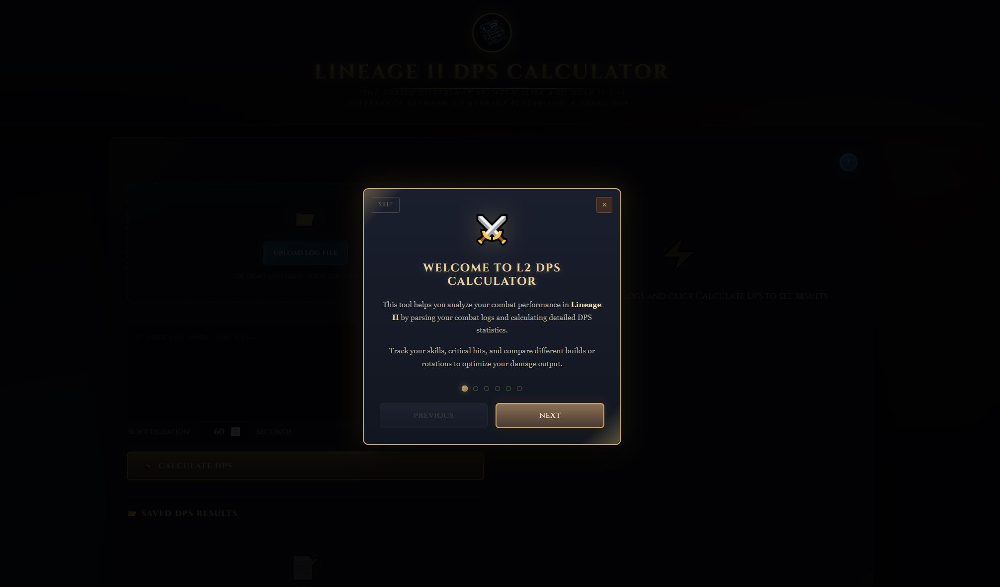
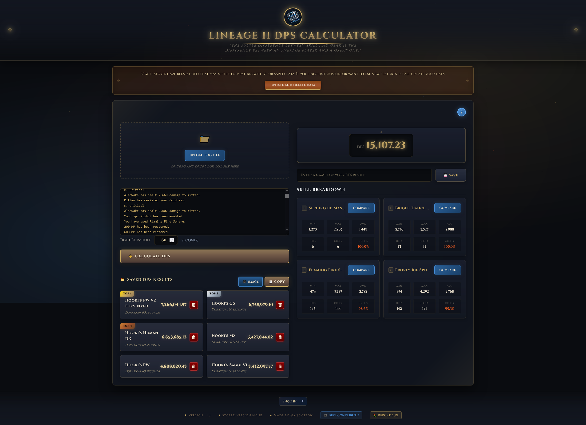
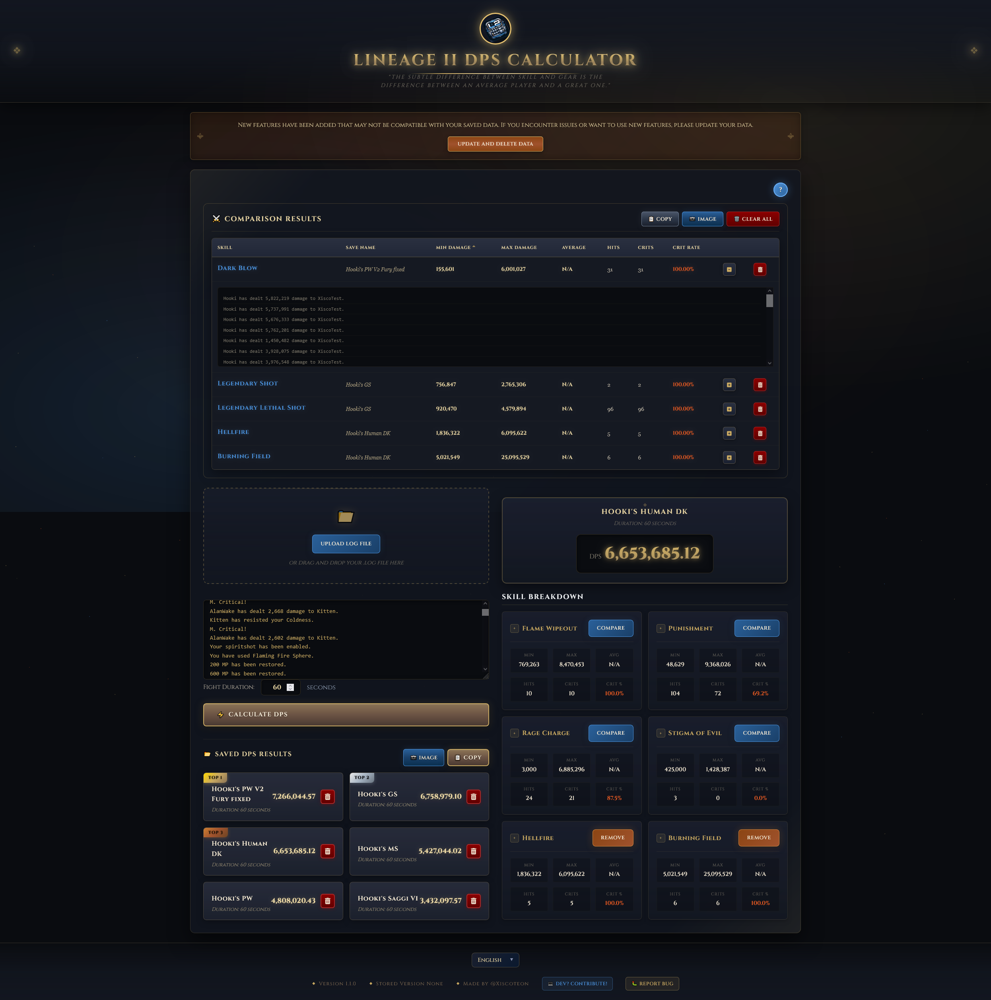

# L2 DPS Calculator

[](https://xiscob.github.io/l2-dps-calculator/)
[](https://opensource.org/licenses/MIT)
[](https://reactjs.org/)

> Client-side Lineage 2 combat log parser. Calculates DPS, breaks down per-skill statistics (min/max/avg damage, critical hit rates), and lets you save and compare results across sessions. Supports 10 languages. No backend — all processing runs in the browser.

**Live:** [https://xiscob.github.io/l2-dps-calculator](https://xiscob.github.io/l2-dps-calculator/)

---

### Screenshots

<p align="center">
  
</p>
<p align="center">
  
</p>
<p align="center">
  
</p>

---

## What It Does

Parses `.log` files generated by Lineage 2's `///textcapture` feature. Extracts skill names, damage values, and critical hit events via regex, then computes:

- **DPS** — total damage / user-specified fight duration
- **Per-skill breakdown** — min, max, average damage, hit count, crit count, crit %
- **Comparison** — sortable table comparing skills across multiple saved runs
- **Export** — copy results as text or render to PNG (via html2canvas) and copy to clipboard

## Architecture

Single-Page Application, purely client-side. No backend, no external API calls.

```
index.js
  └── LanguageProvider (React Context)
        └── App
              ├── SEO (dynamic meta tags, renders null)
              ├── LogProcessor (main view)
              │     ├── Onboarding (6-slide tutorial modal)
              │     ├── ComparisonDisplay (sortable comparison table)
              │     └── LanguageSelector
              └── BuffDebuffChecker (placeholder, not active)
```

- **State**: React `useState` / `useEffect` hooks. No global state library.
- **Persistence**: Browser `localStorage` for saved results, language preference, and onboarding status.
- **i18n**: Custom-built translation system — 10 language JSON files with dot-notation keys and `{{variable}}` interpolation via React Context.
- **Build**: Create React App (Webpack, no eject).
- **Deployment**: GitHub Pages via `gh-pages`.

## Tech Stack

| Layer        | Technology                                                                 |
| ------------ | -------------------------------------------------------------------------- |
| Framework    | React 18.2.0                                                               |
| Language     | JavaScript (ES6+)                                                          |
| Styling      | CSS3, responsive (mobile-first, 768px breakpoint)                          |
| Icons        | FontAwesome                                                                |
| Image Export | html2canvas                                                                |
| SEO          | Dynamic meta tags, JSON-LD, Open Graph, Twitter Cards, sitemap, robots.txt |
| CI           | GitHub Actions (Lighthouse SEO audit on push/PR)                           |
| Hosting      | GitHub Pages                                                               |

## Quick Start

```bash
git clone https://github.com/Xiscob/l2-dps-calculator.git
cd l2-dps-calculator
npm install
npm start        # dev server at http://localhost:3000
npm run build    # production build → /build
npm run deploy   # deploy to GitHub Pages
```

## How to Use

1. In Lineage 2, run `///textcapture on` to start logging combat
2. Upload the `.log` file (drag & drop or file picker) or paste the log text
3. Set the fight duration in seconds
4. Click **Calculate DPS**
5. Save results with a name to compare across sessions

## Project Structure

```
├── public/
│   ├── index.html            # HTML with SEO meta, JSON-LD structured data
│   ├── robots.txt            # Multi-agent crawler directives
│   ├── sitemap.xml           # XML sitemap
│   └── llms.txt              # AI crawler content governance
├── src/
│   ├── i18n/                 # 10 language JSON files + context provider
│   ├── components/SEO.js     # Dynamic meta tag manager
│   ├── App.js                # Root component, version management
│   ├── LogProcessor.js       # Core: file ingestion, log parsing, DPS calc
│   ├── ComparisonDisplay.js  # Skill comparison table with sort & export
│   ├── Onboarding.js         # First-visit tutorial modal
│   └── LanguageSelector.js   # Language dropdown
├── docs/
│   ├── screenshots/          # App screenshots
│   └── TECHNICAL-AUDIT.md    # Full technical audit
├── .github/workflows/
│   └── seo-audit.yml         # Automated Lighthouse audit
└── package.json
```

## Features

- **Log parsing** — regex-based extraction of skill usage, damage values (ignoring ≤1), and critical hits
- **10 languages** — EN, ES, EL, PT-BR, ZH, KO, VI, JA, PL, RU with localStorage persistence
- **Save & rank** — saved results sorted by DPS with rank badges (gold/silver/bronze)
- **Skill comparison** — sortable table across saved runs, expandable raw log rows
- **Export** — clipboard (text) and clipboard (PNG image via html2canvas)
- **Onboarding** — 6-slide tutorial, auto-shows on first visit
- **SEO** — JSON-LD structured data, Open Graph, Twitter Cards, dynamic meta tags per language
- **Responsive** — mobile and desktop layouts

## Adding a New Language

1. Copy `src/i18n/en.json` → `src/i18n/<code>.json` and translate
2. Import in `src/i18n/index.js` and add to the `languages` object:

```javascript
import fr from "./fr.json";

export const languages = {
  // ...existing
  fr: { code: "fr", name: "Français", translation: fr },
};
```

It will appear in the language selector automatically.

## Data Storage

All data lives in browser `localStorage`:

| Key                          | Content                                                  |
| ---------------------------- | -------------------------------------------------------- |
| User-provided name           | JSON blob: `{ dps, skillInfo, saveName, fightDuration }` |
| `l2dps_language`             | Language code                                            |
| `appVersion`                 | Version string for migration checks                      |
| `l2dps_onboarding_completed` | Boolean flag                                             |

No data is transmitted to any server.

## Documentation

- [Technical Audit](docs/TECHNICAL-AUDIT.md) — full architecture analysis, component breakdown, engineering decisions, and complexity assessment

## Contributing

1. Fork the repository
2. Create your feature branch (`git checkout -b feature/AmazingFeature`)
3. Commit your changes (`git commit -m 'Add some AmazingFeature'`)
4. Push to the branch (`git push origin feature/AmazingFeature`)
5. Open a Pull Request

## License

MIT — see [LICENSE](LICENSE) for details.

## Author

**@Xiscoteon**

- GitHub: [@Xiscob](https://github.com/Xiscob)
- Project: [https://github.com/Xiscob/l2-dps-calculator](https://github.com/Xiscob/l2-dps-calculator)
- Live Demo: [https://xiscob.github.io/l2-dps-calculator/](https://xiscob.github.io/l2-dps-calculator/)

## Acknowledgments

- Lineage 2 is a trademark of NCSoft Corporation
- This tool is not affiliated with or endorsed by NCSoft
- Built with ❤️ for the Lineage 2 community

---

<p align="center">
  <a href="https://xiscob.github.io/l2-dps-calculator/">Try it Live</a> •
  <a href="https://github.com/Xiscob/l2-dps-calculator/issues">Report Bug</a> •
  <a href="https://github.com/Xiscob/l2-dps-calculator/issues">Request Feature</a>
</p>
