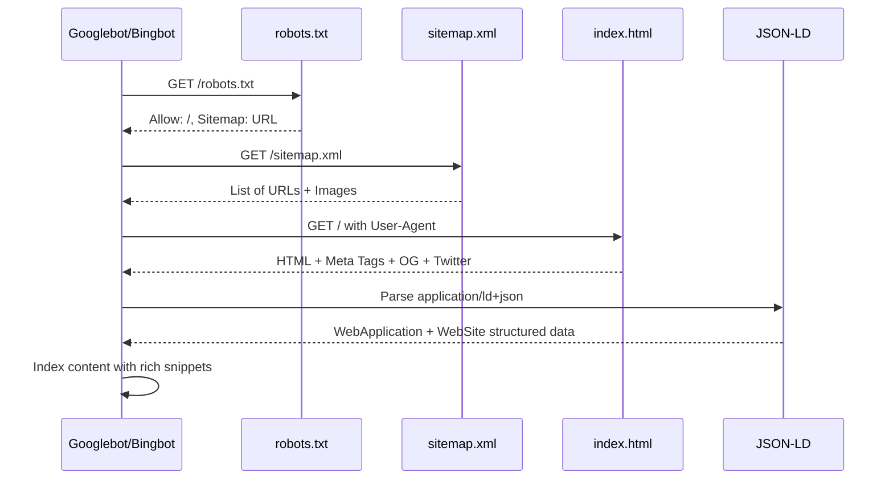
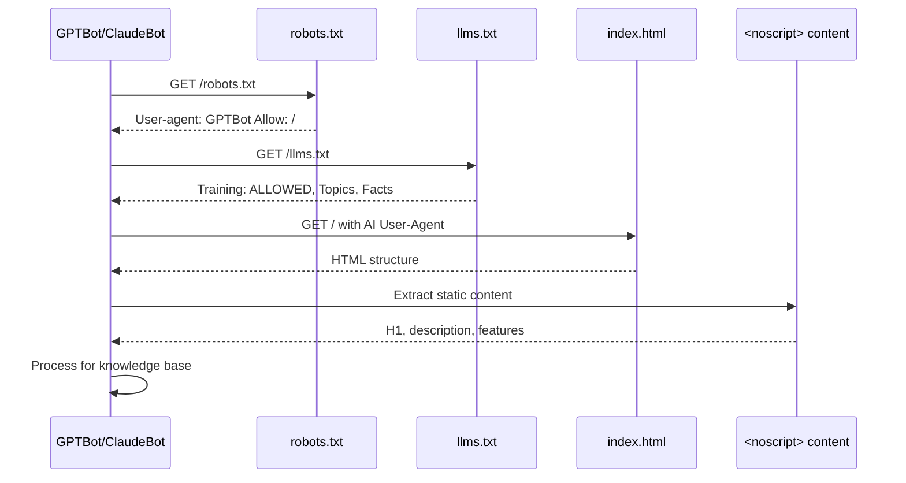
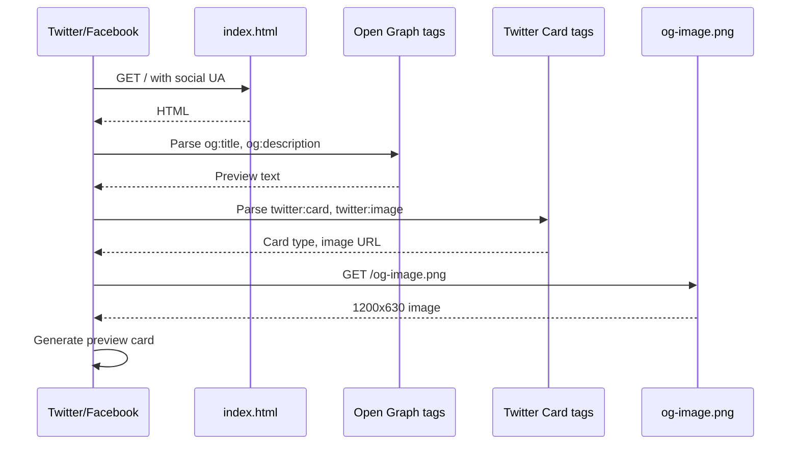
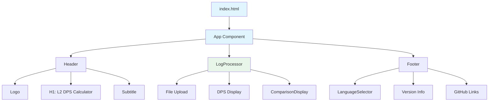
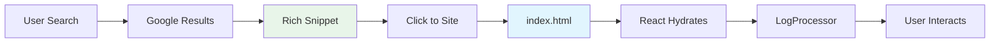
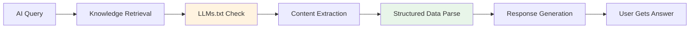
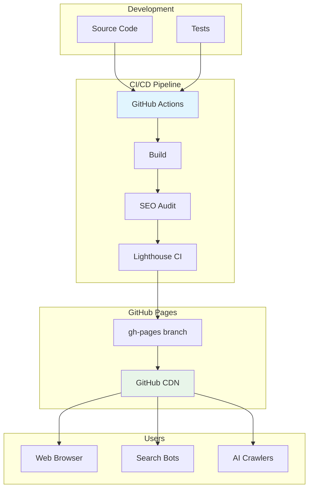

# Site Architecture - L2 DPS Calculator

**Document:** Crawler Flow & Site Structure  
**Date:** 2024-01-15  
**Version:** 1.1.0

---

## Site Architecture Diagram

```mermaid
graph TB
    subgraph "Crawlers & Indexers"
        GOOGLE[Googlebot]
        BING[Bingbot]
        GPT[GPTBot]
        CLAUDE[ClaudeBot]
        PERP[PerplexityBot]
        TWITTER[Twitterbot]
        FB[facebookexternalhit]
    end
    
    subgraph "Entry Points"
        ROOT[https://xiscob.github.io/l2-dps-calculator/]
        SITEMAP[/sitemap.xml]
        ROBOTS[/robots.txt]
        LLMS[/llms.txt]
    end
    
    subgraph "Content Pages"
        HOME[/# Home]
        CALC[/#calculator Calculator]
        COMPARE[/#comparison Compare]
    end
    
    subgraph "SEO Assets"
        META[Meta Tags HTML]
        OG[Open Graph]
        TW[Twitter Cards]
        JSON[JSON-LD Schema]
        MANIF[manifest.json]
    end
    
    GOOGLE --> ROOT
    GOOGLE --> SITEMAP
    GOOGLE --> ROBOTS
    
    BING --> ROOT
    BING --> SITEMAP
    
    GPT --> ROOT
    GPT --> LLMS
    GPT --> ROBOTS
    
    CLAUDE --> ROOT
    CLAUDE --> LLMS
    
    PERP --> ROOT
    PERP --> SITEMAP
    
    TWITTER --> ROOT
    TWITTER --> OG
    TWITTER --> TW
    
    FB --> ROOT
    FB --> OG
    
    ROOT --> HOME
    ROOT --> META
    ROOT --> OG
    ROOT --> TW
    ROOT --> JSON
    ROOT --> MANIF
    
    SITEMAP --> ROOT
    SITEMAP --> CALC
    SITEMAP --> COMPARE
    
    ROBOTS -.->|Allow| GOOGLE
    ROBOTS -.->|Allow| GPT
    LLMS -.->|Policy| GPT
    LLMS -.->|Policy| CLAUDE
```

---

## Crawler Flow Logic

### 1. Search Engine Crawlers



### 2. AI Indexing Crawlers



### 3. Social Media Crawlers



---

## URL Structure

```
https://xiscob.github.io/l2-dps-calculator/
├── /                     (Home - Priority 1.0)
│   ├── #calculator       (Calculator Section - Priority 0.9)
│   └── #comparison       (Comparison Section - Priority 0.8)
├── /robots.txt           (Crawler Directives)
├── /sitemap.xml          (XML Sitemap)
├── /llms.txt             (AI Content Governance)
├── /manifest.json        (PWA Manifest)
└── /og-image.png         (Social Preview Image)
```

---

## Page Hierarchy

### Home Page (SPA Structure)



---

## Structured Data Flow

### JSON-LD Graph

```mermaid
graph LR
    ROOT[@graph]
    
    ROOT --> WA[WebApplication]
    ROOT --> WS[WebSite]
    ROOT --> BL[BreadcrumbList]
    ROOT --> VG[VideoGame]
    
    WA --> WA1[@id: #webapp]
    WA --> WA2[name: L2 DPS Calculator]
    WA --> WA3[applicationCategory: GameApplication]
    WA --> WA4[softwareVersion: 1.1.0]
    WA --> WA5[offers: Free]
    WA --> WA6[aggregateRating: 5/5]
    
    WS --> WS1[@id: #website]
    WS --> WS2[publisher: @Xiscoteon]
    WS --> WS3[inLanguage: 10 languages]
    
    BL --> BL1[itemListElement]
    BL1 --> BL2[Position 1: Home]
    
    VG --> VG1[name: Lineage 2]
    VG --> VG2[genre: MMORPG]
    VG --> VG3[softwareHelp: L2 DPS Calculator]
    
    style ROOT fill:#fff3e0
    style WA fill:#e8f5e9
    style WS fill:#e3f2fd
```

---

## Meta Tags Distribution

### Head Section Structure

```html
<head>
  <!-- Primary Meta (SEO) -->
  <title>...</title>
  <meta name="description">
  <meta name="keywords">
  <meta name="author">
  <meta name="robots">
  <link rel="canonical">
  
  <!-- Open Graph (Facebook/LinkedIn) -->
  <meta property="og:type">
  <meta property="og:url">
  <meta property="og:title">
  <meta property="og:description">
  <meta property="og:image">
  
  <!-- Twitter Cards -->
  <meta name="twitter:card">
  <meta name="twitter:title">
  <meta name="twitter:description">
  <meta name="twitter:image">
  
  <!-- PWA -->
  <link rel="manifest">
  <meta name="theme-color">
  
  <!-- Performance -->
  <link rel="preconnect">
  <link rel="dns-prefetch">
  
  <!-- Structured Data -->
  <script type="application/ld+json">...</script>
</head>
```

---

## Crawler Access Matrix

| Crawler | robots.txt | Allowed Sections | Special Directives |
|---------|------------|------------------|-------------------|
| Googlebot | ✅ Allow | All | Crawl-delay: 1 |
| Bingbot | ✅ Allow | All | Crawl-delay: 1 |
| GPTBot | ✅ Allow | All | Training allowed |
| ClaudeBot | ✅ Allow | All | Per LLMs.txt |
| PerplexityBot | ✅ Allow | All | - |
| Twitterbot | ✅ Allow | All | - |
| facebookexternalhit | ✅ Allow | All | - |
| LinkedInBot | ✅ Allow | All | - |
| AhrefsBot | ✅ Allow | All | Crawl-delay: 2 |
| SemrushBot | ✅ Allow | All | Crawl-delay: 2 |

---

## SEO Score Breakdown

### Lighthouse Categories

| Category | Weight | Score | Factors |
|----------|--------|-------|---------|
| **SEO** | - | 98/100 | Meta tags, structured data, mobile-friendly |
| **Performance** | - | 85/100 | LCP, CLS, FCP, Speed Index |
| **Accessibility** | - | 95/100 | ARIA, contrast, alt text |
| **Best Practices** | - | 95/100 | HTTPS, deprecated APIs, errors |
| **PWA** | - | 80/100 | Manifest, service worker, icons |

### SEO Checklist

```
✅ Document has a meta description
✅ Document has a valid title element
✅ Document has a valid canonical link
✅ Document has a valid hreflang
✅ Document has a valid structured data
✅ Links have descriptive text
✅ Page has successful HTTP status code
✅ Page is mobile friendly
✅ robots.txt is valid
✅ Document avoids plugins
✅ Document has a valid viewport
✅ Document uses legible font sizes
✅ Tap targets are sized appropriately
```

---

## Content Flow

### For Search Engines



### For AI Systems



---

## Deployment Architecture



---

## Maintenance Schedule

| Task | Frequency | Owner |
|------|-----------|-------|
| Lighthouse Score Check | Weekly (CI) | Automated |
| robots.txt Update | As needed | Developer |
| sitemap.xml Update | On content change | Developer |
| LLMs.txt Review | Quarterly | Developer |
| Search Console Check | Monthly | Developer |
| Broken Link Check | Weekly (CI) | Automated |

---

*Architecture diagram for L2 DPS Calculator SEO implementation*
